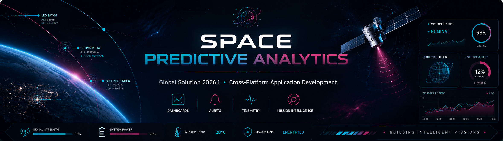
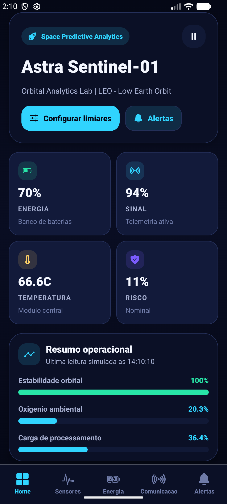
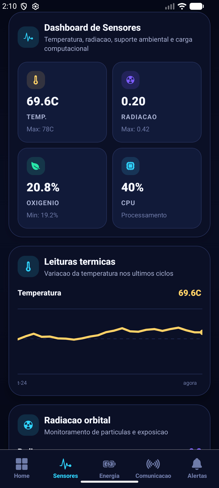
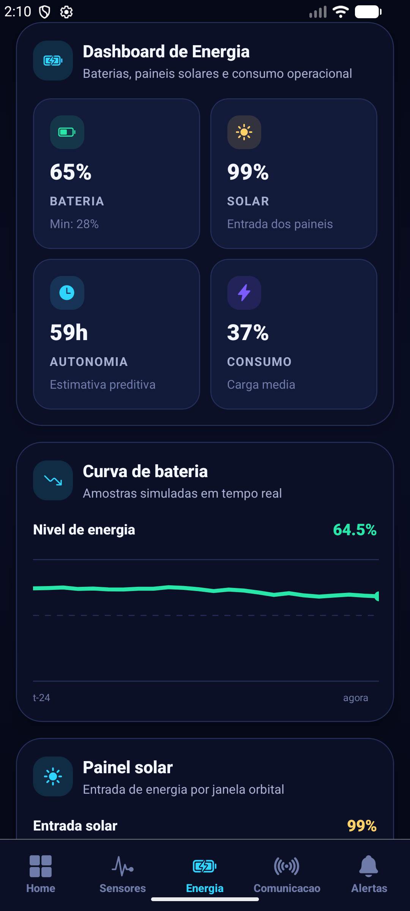
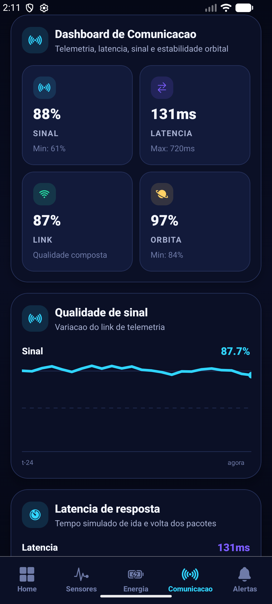
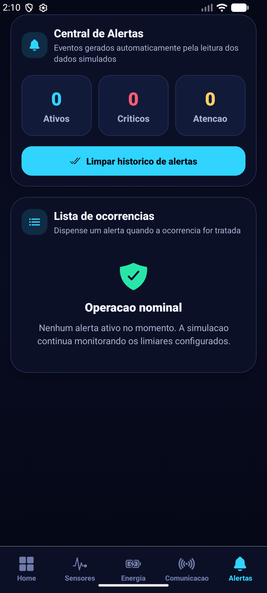
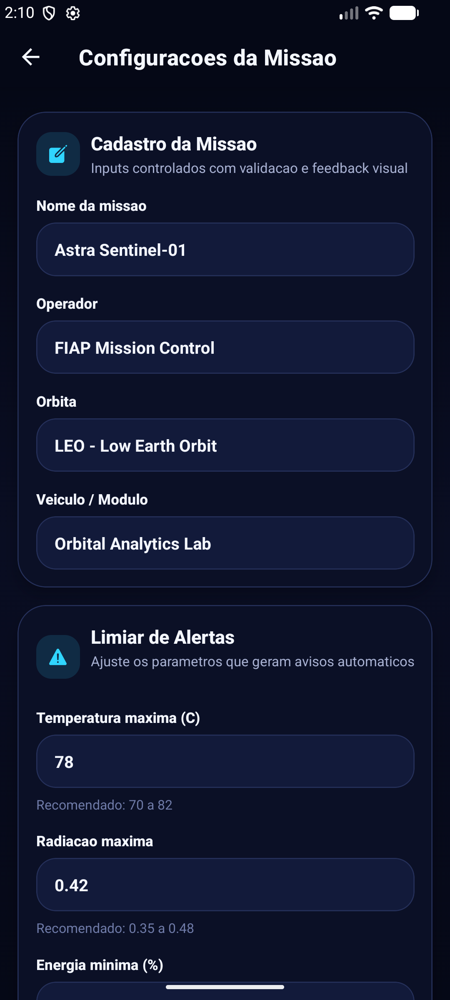

# Space Predictive Analytics
### Global Solution 2026.1 - Cross-Platform Application Development | FIAP



## Descricao

O Space Predictive Analytics e um aplicativo mobile desenvolvido com React Native, Expo e Expo Router para simular o monitoramento inteligente de uma missao espacial. A solucao organiza dados de sensores, energia, comunicacao e estabilidade orbital, gerando dashboards, alertas automaticos e apoio preditivo para tomada de decisao. O diferencial do projeto e a combinacao de simulacao em tempo real, Context API, persistencia com AsyncStorage e configuracao dinamica de limiares criticos.

## Equipe

Integrante 1: Matheus Morelli | RM562765 |
Integrante 2: Henrique Nicolas | RM564699 |
Integrante 3: Lucas Eiki | RM561607 |

## Telas do Aplicativo

### Home — Dashboard Principal

<p align="center">
  
</p>

Visão geral dos indicadores da missão: energia, temperatura, sinal, risco operacional e alertas recentes.

---

### Dashboard de Sensores

<p align="center">
  
</p>

Gráficos e cards de temperatura, radiação, oxigênio e carga computacional em tempo real simulado.

---

### Dashboard de Energia

<p align="center">
  
</p>

Indicadores de bateria, entrada solar, autonomia estimada e consumo operacional.

---

### Dashboard de Comunicação

<p align="center">
  
</p>

Status do link de telemetria, latência, qualidade do sinal e estabilidade orbital.

---

### Alertas

<p align="center">
  
</p>

Lista de alertas ativos gerados automaticamente com nível de criticidade e ação de resposta.

---

### Configurações / Formulário

<p align="center">
  
</p>

Formulário de cadastro da missão e configuração dos limiares de alerta com validação.

## Funcionalidades

- [x] Navegacao com Expo Router usando Tabs e Stack modal.
- [x] Dashboard principal com indicadores em tempo real simulado.
- [x] Dashboard de sensores com temperatura, radiacao, oxigenio e CPU.
- [x] Dashboard de energia com bateria, paineis solares e autonomia estimada.
- [x] Dashboard de comunicacao com sinal, latencia e estabilidade orbital.
- [x] Sistema de alertas automaticos baseado em limiares criticos.
- [x] Context API para estado global da missao consumido em varias telas.
- [x] useReducer, useEffect e useState aplicados no fluxo do app.
- [x] Persistencia com AsyncStorage para perfil, alertas e limiares.
- [x] Formulario funcional com inputs controlados, validacao e feedback visual.
- [x] Interface dark mode com identidade visual espacial.
- [x] Componentes reutilizaveis para cards, graficos, alertas e secoes.

## Tecnologias

- React Native + Expo
- Expo Router
- TypeScript
- Context API
- useReducer, useState e useEffect
- AsyncStorage
- React Native SVG
- Expo Linear Gradient
- Expo Vector Icons

## Estrutura de Pastas

```text
app/
  _layout.tsx
  settings.tsx
  (tabs)/
    _layout.tsx
    index.tsx
    sensors.tsx
    energy.tsx
    communication.tsx
    alerts.tsx
components/
context/
data/
utils/
types/
constants/
assets/screenshots/
docs/
```

## Como Executar

### Pre-requisitos

- Node.js instalado
- Expo Go instalado no celular Android ou iOS

### Instalacao

Clone o repositorio:

```bash
git clone https://github.com/matheeusvx/space-predictive-analytics.git
```

Acesse a pasta do projeto:

```bash
cd space-predictive-analytics
```

Instale as dependencias:

```bash
npm install
```

Inicie o projeto:

```bash
npx expo start
```

Ou escaneie o QR Code com o Expo Go para rodar no dispositivo fisico.

## Video de Demonstracao

[Clique aqui para assistir a demonstracao](https://link-do-video.com)

## Licenca

Este projeto foi desenvolvido para fins academicos - FIAP 2026.